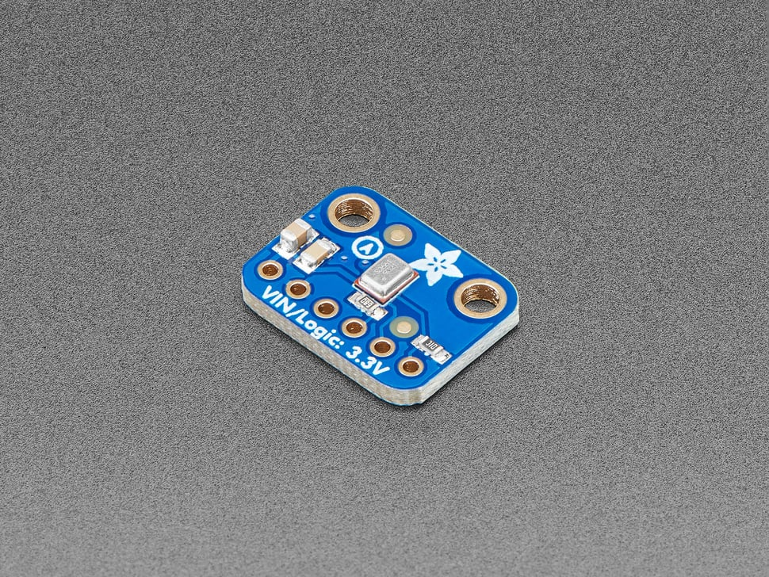
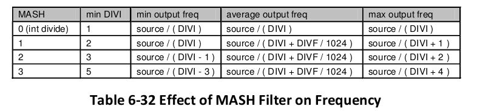

## Using an I2S to make an acoustically reactive display.

Today we mostly get an I2S microphone working and then hopefully you 
can run the output through an FFT and display on your light strip.
Everyone loves blinky stuff.

This is partially based on Parthiv's lab from 340lx:
  - [i2s lab](https://github.com/dddrrreee/cs240lx-22spr/tree/main/labs/17-i2s)

You can just use that lab directly if you like; it's a succinct, quick
lab in its current form.   

This write up has more discussion of where numbers come from.

Main lab goals:
  1. Get i2s + the PCM clock it needs working and sanity check the results
     using a loopback.
  2. Get some mic readings.
  3. Run through an FFT.
  4. Play several known signals from your phone (eg 500hz) and see that it
    gets decoded correctly.
  5. Display the spectrum results somehow.

The new code is in `code`.  Parthiv's lab code is in `code-parthiv`.

The tl;dr on what to do:

  1. Configure the PCM clock to use the 19.2MHz oscillator.  
     1. Disable the clock: Set ENAB=0, Passowrd=0x5a, and wait
        til BUSY=0 (page 107).
     2. Set DIVI=6, DIVF=3288, and MASH=1 (see the discusson below) to
        scale the (this is clock 1 from page 105).

---------------------------------------------------------------
### 1. How to configure the SPH0645LM4H-B I2S microphone.

We use [adafruit breakout](https://www.adafruit.com/product/3421) for
the SPH0645LM4H-B I2S MEMS microphone.

  

The [SPH0645LM4H datasheet](./docs/SPH0645LM4H-datasheet.pdf) is pretty
short and, because there is not much going on, relatively approachable.

However, one issue I had is that its description is a different type
than the previous devices we've used.  Rather than, say, a list of the
specific set of I2C or SPI commands it responds to, the mic is mostly
described in terms of its input clock requirements and the data size
and format it generates.  I don't know if this is fundamentally harder
than our other devices --- as typed out it sounds easier, especially
as compared to the 70+ page NRF we did previously --- but it requires
a bit different reasoning, at least for me.

Related, it was easy to make clock frequency mistakes in terms of (1) how
fast it ran, (2) how the BCLK and FS (also refered to as WS) clocks are related, and (3) 
how to
specify the actual clock speed on the rpi.  This latter task being made
more exciting by the expedient method of the Broadcom BCM2835 datasheet
simply not containing any description of the needed PCM clock, which you
have to piece together from the BCM2835 erata and blog posts.  (The linux
source is also useful, though there is a bunch of infrastructure code
that occludes what is going on in many places.)

Clock and frequency mistakes are a problem for multiple reasons, one of
which is that if the supplied clock is less than 900,000 cycles per second
(900KHz) the device remains in sleep mode and produces no output.

To summarize the datasheet (from page 8):
  - BCLK must be in the 2048KHz to 4096KHz range.
  - WS must change on the falling edge of BCLK (Broadcom says this is
    default: p 120).
  - WS must be BCLK/64 (have a cycle (or "period") equal to 64 BLCK
    cycles).  It has a "50% duty cycle" where it is low (0) 32 BCLK
    cycles and then high (1) for 32 BCLK cycles.
  - The hold time must be greater than the hold time to the receiver (not
    sure what this refers to, tbh).
  - The mode must be i2s with MSB delayed 1 BCLK cycle after WS changes
    (we will see this is the default when we measure).
  - In order for the mic to output its SELECT pin must be connected to 
    3v or ground: For the default i2s configuration only 3v will work.

A bit longer, not-necessarily-complete cheat-sheet of key facts:
  - supply voltage: 3.6max, 1.62min (current draw is small enough
    that gpio pin seems to work).  (page 2)

  - clock frequency: min=2048KHz up to max=4096KHz.  NOTE: the
    use of KHz (kilohertz)!  This means minimum clock 2,048,000hz (cycles
    per second) *not* 2048 hz.  Similarly, the max is 4,096,000hz not
    4096Hz.  

    (I made this mistake since they these numbers are powers of two in
    Hz and ugly non-powers of two in kHz.  It seemed that kHz was just
    a redundant editorial comment rather than stating the value must be
    multplied by 1000.)

    You can sanity check this calculation by recomputing it from the
    the minimum and maximum clock periods (page 4) --- the total time
    the clock pin is held low and then high (a single clock cycle).

    The maximum time is 488.28 nanoseconds and the min is 244.14ns.
    The 488.28ns (maximum time) corresponds to the *slowest* clock speed
    of 2048KHz since that will be when the clock pulses the longest and
    the shortest 244.14ns corresponds to the max clock speed.

    You can verify their number and check your understanding by dividing
    the number of cycles (2048Khz or 2048*1000) that occur in one second
    and multiplying the result by one billion (10^9) to get nanoseconds:

            1/(2048*1000) * 1000*1000*1000 = 488.28125 (ns).

    You can similarly verify the values for the fastest clock:

            1/(4096*1000) * 1000*1000*1000 = 244.140625(ns).

    NOTE: Cross-checking and rederiving values is a good way to
    mechanically detect where you've misunderstood a datasheet or made
    some dumb mistake despite understanding it.  (Embarassingly if I did
    this particular cross check a priori rather than a posteriori,
    I'd have saved about an hour of wrong-effort.)

  - Power up time: 50ms (page 2).  Given our usage, I'm not sure how
    much this matters.  But if you were making real recordings, you
    would likely want to skip the first 50ms of readings.

    As discussed before, many devices are not simple switches or LEDs
    where we can immediately start using their values or controlling
    them after powerup.  The more complex the device the more work it
    may well need to do before it is in a clean, initialized state.

  - Output date is 18 bits of precision (page 3).  If the i2s master
    configures the protocol to transfer more bits per reading (discussed
    below) the low bits of the value will be 0s.    As stated on 
    page 7, the data format is 2's complement: in practice this means
    the high bits of the readings will be 1s (a negative number).
    One consequence is that when the measured value is close to silence,
    the output result will be a large unsigned value (`0xf...`) and it
    will dip down to a *smaller* number if you blow on the mic.  This is
    counter intuitive if you don't realize the mic outputs a signed value,
    and you might wind up wasting more time trying to figure out what
    is going on, assume you've swapped the data or are getting garbage.

  - As the datasheet states, the mic is a i2s slave, which means we
    have to configure the i2s hardware on the pi to control it (i.e., be
    in in master mode).  Among other things this means the pi suppliies
    this clock signal as well as WS (a sort-of additional clock that
    denotes complete frames).  Since our pi doesn't magically know what
    the microphone needs for a clock we will have to figure out how to
    configure it to supply it (below).

  - the device gives a PCM output which is 64 times "decimated" (sampled)
    from a continuous PDM output.  The i2s bcm2835 section discusses
    both PCM and PDM and its easy to get confused, but keep in mind we
    have a PCM output.

  - Key fact: from page 7: you have to have the select pin tied to
    either ground (LOW) or 3v (HIGH) to have the device output a single
    channel.  Otherwise it does not output anything.  Whether you use
    LOW or HIGH determines when the data is output ---- either when
    WS is LOW or when it's HIGH.  We'll need to keep this in mind when
    looking at the i2s configuration. For the default i2s you'll need
    to connect SELECT to 3v.

  - Again (page 7): frequencies <= 900KHz puts the device to sleep.

  - Key (page 7): because of oversampling, the WS signal rate (i.e.,
    the sampling rate of the microphone) must be exactly 64 times slower
    than the clock (CLK/64).  So if we want to sample values at 44.1KHz,
    the i2s BCLK clock must be:

         44.1 * 1000 * 64 = 2,822,400 (Hz)

    Confusingly, as we discuss below, the pi doesn't just let you set
    a literal clock rate, you have to put it in terms of dividing the
    rate of a different (faster) clock.

  - Note: as page 7 warns: we should have a single 100K Ohms resistor
    from the data pin to ground to handle bus capacitance.  We don't
    though.  Hopefully the breakout board does! 

---------------------------------------------------------------------------
### 2. How to configure the bcm2835 PCM clock.

As discussed above, the i2s microphone expects a clock signal that
should switch at a rate of the sample rate times 64.  As shown above,
if we want to sample at 44.1 kHz the clock will be:

         44.1 * 1000 * 64 = 2,822,400 (Hz)

If you come from software, an additional source of confusion is that
we can't just set "the clock" to this value of 2.8224Mhz (as we would
with a variable) but instead must express it as a divisor (integer and
fractional part) of some other clock.  This is a bit weird.  It also
means you have to pay attention to the period of the other clock and
find one that (ideally) divides with no remainder.

The pi provides a PCM clock for this purpose, though as the [errata
notes](https://elinux.org/BCM2835_datasheet_errata)
the broadcom 2835 datasheet doesn't discuss it.   Several sources of
information:
  - The BCM2835 [errata](https://elinux.org/BCM2835_datasheet_errata).
  - [i2s test code used by the eratta](https://github.com/arisena-com/rpi_src)
  - [the Linux i2s driver](docs/bcm2835-i2s.c)

From the errata, the PCM clock has two registers:
  1. The PCM control register at `0x7E101098` (so for us `0x20101098`), 
     which has the same layout as the GPU control register on page 107 of
     the BCM2835 datasheet.
  2. The PCM divisor register at`0x7E10109C` (so for us `0x2010109C`),
     which has the same layout as the GPU divisor register on page 108 of
     the BCM2835 datasheet.

The key bits in the control (page 107):
  - `31-24`: a byte length "password" (value `0x5a`) you must set for
    the device to perform changes.  This is a common hack to try to 
    reduce the chance of wild writes.  Whenever you store to this
    register, the upper byte must have this magic value.

  - bits 10-9: the MASH flag: this controls whether the DIVF field of
    the divisor register (discussed below) is used (MASH=1,2,3) or
    ignored (MASH=0).  As we show below you can verify this behavior by
    looping the clock back and measuring how many cycles for each low
    or hi signal.

  - bit 7: the BUSY flag: don't change the clock while this is set other
    than to set ENAB=0.

  - bit 4: the ENAB flag.  You must disable the clock (ENAB=0)
    *and* wait til BUSY=0 before changing the clock.

  - bits 3-0: the clock source.  The basic idea is to pick a clock source
    that (1) is high enough to give a good signal and (2) hopefully
    divides evenly by the clock value you actually want.  From the eratta
    and the bcm2835 i2s linux driver, the recommendation is to use the
    "oscillator" (source = 0b0001) which is an XTAL crystal oscillating
    at 19.2MHz --- this is larger than the 2.8224MHz clock we need (good)
    but does not evenly divide it (sad).

The key bits in the divisor register (page 108):
  - `31-24`: a byte length "password" (value `0x5a`).  This works the
     same as in the control register.
  - `23-12`: DIVI: the integer part of the divisor.
  - `11-0`: DIVF: the fractional part of the divisor that results by
    (1) *multiplying it by 4096* and then (2) truncating it (taking
    the integer portion).

    This is super confusing and comes from the Broadcom formula on page
    105 Table 6-32 which (after eratta correction) gives the average
    output for a non-zero values of MASH as:

      rate = clock source / (DIVI + DIVF / 4096)

  

Putting it all together: To find the fractional divider of the 
19.2Mhz clock to express a 44.1 khz sample rate:

      rate = (19.2*1000*1000) / (44.1 * 1000 * 64)
            = 6.8027210884353737

Not great, since not even.

As noted above, to express the fractional part of this result, we don't
just set DIVF to 8027 (the first four digits after the decimal).  Instead
you multiply the fractional number by 4096 and do integer truncation.  So:

    DIVF = round(.8027210884353737 * 4096) 
         = round(3287.9455782312907)
         = 3288

You can check this result by plugging the result (DIVI = 6, DIVF =
3287, MASH=1) back in to the corrected Table 6-32 formula:

    rate = source / (DIVI + DIVF / 4096)
         = 19.2Mhz / (6 + 3288. / 4096)
         = 2,822,394.4875107664

or a bit less than 6 cycles off of 2,822,400 Hz.

You can see that this result is as close as we can get with the 
tools we got by recomputing with DIVF + 1:

        = 19.2Mhz / (6 + 3289. / 4096)
        = 2822293.1993540283

And DIVF - 1:

        = 19.2Mhz / (6 + 3287. / 4096)
        = 2822495.7829379463

Both of which are farther away from 2,822,400.  To get even closer we
could also do MASH correction, but I'll ignore that.

#### Loopback to check the clock.

At this point it should be pretty clear that a clock isn't a wristwatch
and is easy to make mistakes with.

And, unfortunately, unlike null pointers, the microphone garbage that
results from clock mistakes will be hard to detech.  So as part of setup
we will try to check what we can to make sure that things make sense.
(I recommend this in general!)

The easiest thing to check is that i2s clock: just connect ("loopback")
a jumper wire from the BCLK clock GPIO pin (18) to some unused input
pin and measure the time for a reading to go through a complete 0 to
1 transition.  In our case, how many cycles the pin reads 0 plus how
many cycles it reads 1.  (Or vice versa: doesn't matter.)  We expect
the numer of cycles to be roughly

A secondary check is to do the same thing for the WS GPIO pin and make
sure the time it takes to do a complete 0 to 1 transition is 64x the
value of the BCLK plus 1 for the transition period.

From the bcm2835 pin table:

  

We see the BCLK pin is 18 and the FS pin is 19.  So just do loopback
using these.

We need to compute the expected cycles per sample:

        = ARM cycles per second / samples per second
        = 700 MHz  / 44.1khz*64
        = 700*1000*1000 / (44100*64)
        = 248.

For the FS we expect this multiplied by 64.  If you set to a non-zero
value you should get close.  If MASH=0 you'll see its way off.  (This
check saved me from a dumb mistake where I ignored MASH becasuse I didn't
care about smoothing and so missed its role in using the DIVF part.)

---------------------------------------------------------------
### 3. How to configure I2s.

For what it's worth, I've annotated the BCM document a bit:
  - [BCM2835-i2s.annot.pdf](./docs/BCM2835-i2s.annot.pdf).

The `./docs` directory also has:
  - [The original (short!) Philips specification](./docs/i2s-specification.pdf).
  - [A decent TI application note](./docs/slaa449a.pdf)

Key rules:
  - (p 121): the control registers are not synchronized and should be programmed
    before the device is enabled and not changed while it is running.
    
    NOTE: "enabled" is used in a very confusing way.  This refers to
    whether TX or RX is enabled, and does not refer to whether the EN
    (enabled) field (bit 0 of CS_A on page 129) is set to 1.  In fact, 
    you'll have to set EN=1 to wake the device up before you do anything.

    To configure the device you'll follow the steps on page 122
    "Operating in Polled mode" by (1) set EN=1 so the device wakes up,
    (2) set all configuration and then (3) set RXON=1 to begin operation.
    Very confusing.

  - (p 122): data always sent most-significant bit first.

  - (p 122): as mentioned above: follow the steps in
    "operating in polled mode" and end of 122, start of 123.

  - (p 124) As usual when we enable a device we want to clear all 
    internal state (in case it was left): in this case we disable TXON and
    RXON and clear the two FIFOS TXCLR and RXCLR using the SYNC bit to
    wait the two I2s cycles (this is the clock speed of the device
    not the clock speed of the ARM!) needed for the operation to 
    occur.

  - (p 125): the PCM registers start at 0x7e203000 (so for us:
    0x20203000) and are given in the table at the bottom of the page.
    They at increasing word offsets.

For receiving mic data, the key bits of the CS_A register:

  - SYNC (bit 24, p 126): used to wait for effects to occur.  You write
    a 1 to it, and then spin until it returns 1.  (NOTE: in general,
    we might actually need to write the negation to it and then wait.
    Currently we only use once after reset, so writing a 1 works.)

  - RXDX (bit 20, 127): non-zero if we have a sample.  Used to know when a 
    mic sample is available.
  - RXERR (bit 16, 127): non-zero if have an RX error.    Happens if we
    read too slow.  At this point probably should clear the RXFIFO and clear
    the error.
  - We don't use interrupts or thresholds, so can ignore these flags.
  - RXCLR (bit 4, p 128): used to clear the RX FIFO.  Do this at startup
    just to be safe.
  - RXON (bit 1, p 129): used to enable RX as the last step of our process.
  - EN (bit 0, p 129): used to power on the device out of sleep as the
    first step of configuration.  Unclear how long to wait.  We perhaps
    should use the SYNC bit to detect?

  - Summary: at the end, RXON=1, EN=1.

The `FIFO_A`  register is used to read samples:
  - note this will be a signed 32-bit value, high bits sent first.
    Since the mic only provides 18 bits, the low 16 bits should all
    be zero.  (You should check this.)

The `MODE_A` register is used to configure the channel and FS values:
  - `CLK_DIS` (bit 28, p 130: disable the clock before setting the PCM
    clock.  Use the SYNC bit to wait for the dffect to take place.
  - `CLKM` (23, p 130): the default is 0 which means master mode, so we
    can leave it as-is.
  - `FSM` (21, p 131): the default is 0 which means master mode, so we
    can leave it as-is.
  - `FSI` (20, p 131): if you connect the mic select to ground you'd have
    to invert this to get the signal.
  - `FLEN` (19:10) frame length.   0 means a lenght of 1 clock.  We need
    the frame length to be 64 clocks (from the mic data sheet) so set this
    to 63.
  - `FSLEN` (9:0) frame sync length.  We want half on, half off, so set this
    to 32 (32 cycles off, 32 cycles on).

  - Summary: at the end, FLEN=63, FSLEN=32.

The key bits of the `RXC_A` register (p 131) 
  - CH1WEX (31): MSB of the channel 1 width.   (see below)
  - CH1EN=1 (30) to enable channel 1.
  - CH1WID (19:16) used to compute channel 1 width using the formula
    `CH1WEX*16 + CH1WID + 8`.  We want a channel width of 32.
    Which implies CH1WEX=1 and CH1WID=8 via `32 = 16 + 8 + 8`.
    (Yeah, a bit awkward.)
  - We don't use channel 2 so ignore these.
  - Summary: CH1EN=1, CH1WEX=1, CH1WID=8.

We don't use the rest of the features so can ignore them.

Note: the PCM clock, GPIO and PCM device are all different hardware
devices so make sure you use device barriers!

To test the mic I would play different known test signals from your
phone.  It probably can't play low frequencies so stick with higher ones?
If you're confused about FFT and how to use it, it's a bit cringe chatGPT
both gave decent answers.  (Ask for synthetic tests so you can double
check results.)

