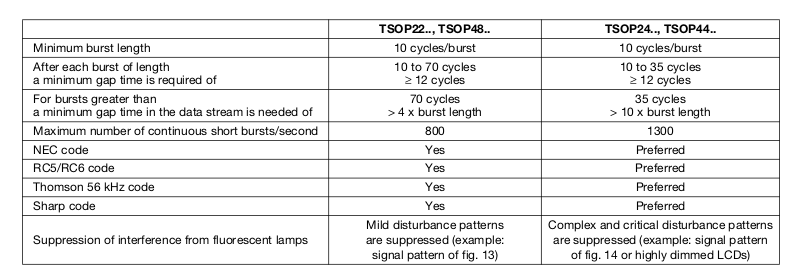

## IR bootloader

Today we're going to adapt your IR transmit and receive to bootload
code remotely.  At the end of class you should be able to send code to
someone else's pi and have it run.

Motivation:
  1. Network bootloading is very useful and we'll do it later in the 
     quarter, so might as well do it now.
  2. Transmitting over IR takes much less code than, say, NRF so its
     easier to wrap your head around.
  3. Once this works, it should be a small delta to also send code
     over a speaker, a stepper moter (you can pulse it to generate
     specific frequencies), or even light.
  4. Also, when I told Dan Boneh what we were doing he said "cool!" and
     started listing other ideas.

Outline:
  1. we'll write a more robust protocol than the UART from last lab.
     If you look at the datasheet it's unclear why UART worked given
     that the IR device requires quiet periods after each transmission
     that last longer than the transmission itself.

  2. Your code should work with sending a "Hello World", a one-way
     counter and a ping-pong.

  3. You then will write a simple packet protocol that sends and receives
     checksum'd packets.

  4. You should then be able to send code and jump to it.

There's tons of extensions:
  - Play tricks to make the binary smaller. For example, use system
    calls for the routines (so they don't need to be included)
  - Tune your protocol so its faster.
  - Do the next lab to let your copy code anywhere and run it.

### Part 1.  IR Protocol.

  

As you can see from the table, there are a bunch of restrictions we
ignored last lab.  For example:
  - Minimum burst width is 10 cycles (so about 23usec * 10).
  - After a minimum burst width we have to wait 12 cycles.
  - for long bursts (more than 70 cycles) we have to wait 4 x burst
    length.
  - We can't send more than 800 bursts a second.

TBH, I'm surprised our code worked.   But in any case, let's do a 
protocol that is more robust.  We'll model is sort-of on the IR
protocol for your remote in that each burst (where we cycle the LED
off and on at 38khz) will be paired with a longer quiet period where
we don't transmit.

  - As before: our default will be non-transmitting (which will
    cause the receiver to read 1).

  - To send a 1, we will do a burst of `burst_1` cycles followed by
    a quiet period of `quiet_1` cycles.

  - To send a 0, we will do a burst of `burst_0` cycles followed by
    a quiet period of `quiet_0` cycles.

A set of slow timings that worked for me:

    enum { 
        tsop_cycle = 9210,
        burst_1 = 100 * tsop_cycle,
        quiet_1 = 4*burst_1,
        burst_0 = 200 * tsop_cycle,
        quiet_0 = 4*burst_0
    };

A set of faster timings that worked for me:

    enum { 
        tsop_cycle = 9210,
        burst_1 = 40 * tsop_cycle,
        quiet_1 = 4*burst_1,
        burst_0 = 80 * tsop_cycle,
        quiet_0 = 4*burst_0
    };

Recall that we computed `tsop_cycle` as:
  1. The device expects a sample rate of 38khz cycles: 
     a full transition on and off 38*1000 times per second.
  2. By default the pi is running at 700MHz, or `700*1000*1000`
     cycles per second.
  3. So each a full cycle is : `700,000,000 / 38,000 = 18,421`.
     And thus the number of cycles to hold each on or off
     should be `18,421/2 = 9120`.

To read a bit:
  - Spin while the IR receiver reads 1.  (extension: add a timeout and change
    the code to handle).

  - Compute how many `cycles`  it stays at 0.

  - Return a 1 if `cycles` is closer to `burst_1` than `burst_0` or 0
    otherwise.  (Similar to your remote IR protocol code)

  - To read a byte: assume they were sent lowest bit first.

To send a bit (as above):
  - send a 0: cycle for `burst_0` and then be quiet for `quiet_0`.
  - send a 1: cycle for `burst_1` and then be quiet for `quiet_1`.

  - To send a byte: send it lowest bit first.

Overall:
  - Never spin and do nothing, instead call `rpi_yield()`.
  - The only safe time to print is when the other side is waiting
    for a message, otherwise you'll mess up timings.
  - The quiet period can have error as long as it is not "too short".
    The bursts must be accurate since if we stray too far from 38Khz
    the receiver will output a 1.  (It will also run into trouble with
    reseting).
  - There is staff code checked in so you can work on the put and
    then get individually.

When the code works:
  - You should be able to send "hello world" to yourself.  Also:
    to someone else's pi (you'll have to modify the code and make
    a seperate snooping version).
  - You should be able to do the one-way test to yourself.  Also:
    to someone else's pi (you'll have to modify the code and make
    a seperate snooping version).

### Part 2. dealing with shared transmission

When we used the NRF you could loopback to yourself without issue
since there were two distinct devices.  For the code today,
we do not have two private receiver/transmitters.  So you will
will need to implement locks.

Given that we are on a uniprocess:
  - what does the lock look like?
  - do you need to lock the transmitter?  The receiver?  Both?

  - When you implement word transmission how do you handle locking
    so there isn't deadlock?

When this works the ping-pong test should work.   Another pi should be
able to snoop on the network and see (you'll have to modify the code
for this).

### Part 3. sending packets.

I used a dumb protocol for sending packets:

  1.  Sender, header:

     - `send32(PKT_HDR)` (see the enum in `ir-put-get.c`).
     - `send32(hash)`: where hash is:

            uint32_t hash = fast_hash_inc32(data, nbytes, 0);

     - `send(nbytes)`

  2. Receiver, get header:

     - Gets the three words.
     - Send ack: `send32(PKT_HDR_ACK)`.

  3. Sender, data:
     - `send32(PKT_DATA)`
     - send the data (using `ir_put8`).

  4. Receiver:
     - Gets `PKT_DATA`
     - Gets the data.
     - computes the checksum and verifies it.
     - `send(PKT_DATA_ACK)`

  5. Sender: if receives `PKT_DATA_ACK` is done.

### Part 4. sending code.

If your packet code works, the bootloader should work too:
  - the code is `small-prog/hello.bin` translated into a byte array 
    (see `small-prog/code-hello.h`) with a header.
  - We send it using `ir_send_pkt` and receive it using `ir_recv_pkt`.
  - The receiver checks the header and then jumps to the code.

There's a ton of extensions to make it faster.

#### What the code looks like.

As a first intermediate hack we'll send code similar to how we did
in the FAT32 and equiv process lab:
  1. Modify the `memmap` to link the code at a
     special address that isn't being used and include a header stating
     its size.
  2. After compiling this program, run the `hello.bin` through a Unix
     program (that we wrote) to turn it into a byte array.
  3. Link this byte array into our code.
 
Now: to send using loopback:
  - We'll have a server thread that sends this using the packet 
    format above. 
  - We'll have a receiver thread that receives the code.
  - If reception worked fine, it will copy the code to the given
    address and jump to it.
  - The code should print "hello world"
